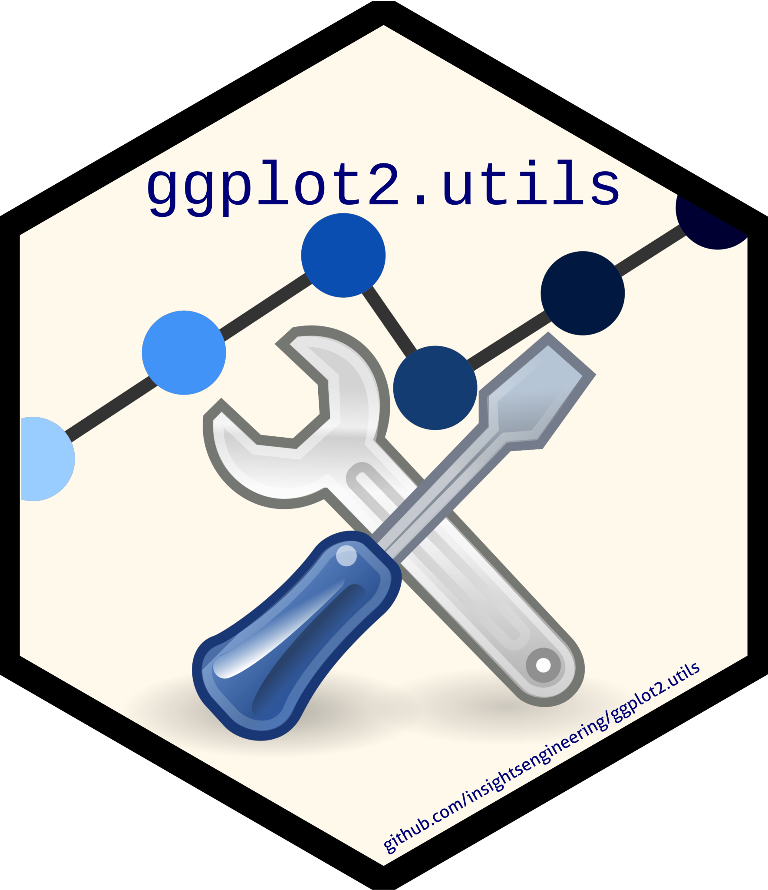

<!-- markdownlint-disable-file -->

<!-- README.md needs to be generated from README.Rmd. Please edit that file -->

# ggplot2.utils <a href="https://insightsengineering.github.io/ggplot2.utils/"></a>

<!-- badges: start -->

[](https://www.repostatus.org/#active)
[](https://www.r-pkg.org/badges/version-last-release/ggplot2.utils)
[](https://cranlogs.r-pkg.org/badges/ggplot2.utils)
[](https://cranlogs.r-pkg.org/badges/grand-total/ggplot2.utils)
[](https://raw.githubusercontent.com/insightsengineering/ggplot2.utils/_xml_coverage_reports/data/main/coverage.xml)
<!-- badges: end -->  

The `ggplot2.utils` package simplifies access to utility functions
adding functionality to [ggplot2](https://ggplot2.tidyverse.org/). The
package imports functions across multiple extensions packages and then
exports them, so that the user only needs to load this package instead
of multiple others. In addition, this package provides layers for
Kaplan-Meier lines and ticks additions to plots.  
All functions are tested to make sure that they work reliably.

## Installation

Typically you want to install the release version. Developers and
beta-testers might want to install the development version.

### Release

You can install the current release version from *CRAN* with:

``` r
install.packages("ggplot2.utils")
```

### Development

You can install the current development version from *R-Universe* with:

``` r
install.packages(
  "ggplot2.utils",
  repos = c("https://insightsengineering.r-universe.dev", "https://cloud.r-project.org")
)
```

Alternatively, you can install the current development version from
*GitHub* with:

``` r
if (!require("remotes")) {
  install.packages("remotes")
}
remotes::install_github("insightsengineering/ggplot2.utils")
```

## Getting Started

Have a look at the package index to explore the available functionality:

``` r
help(package = "ggplot2.utils")
```

## Citing `ggplot2.utils`

To cite `ggplot2.utils` please see
[here](https://insightsengineering.github.io/ggplot2.utils/latest-tag/authors.html#citation).
